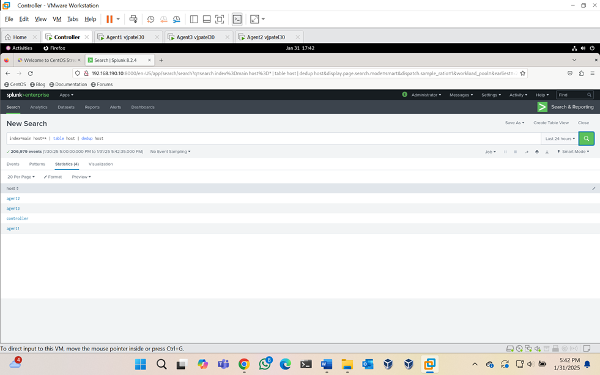
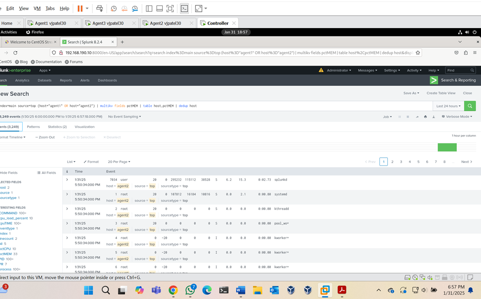
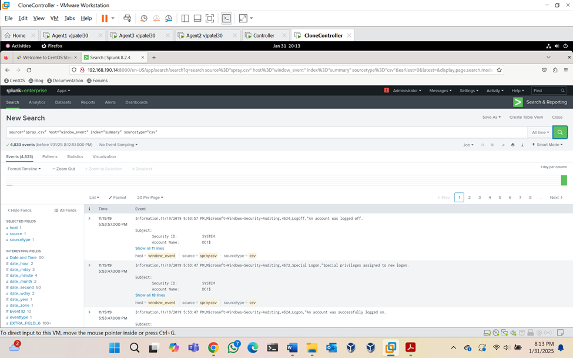
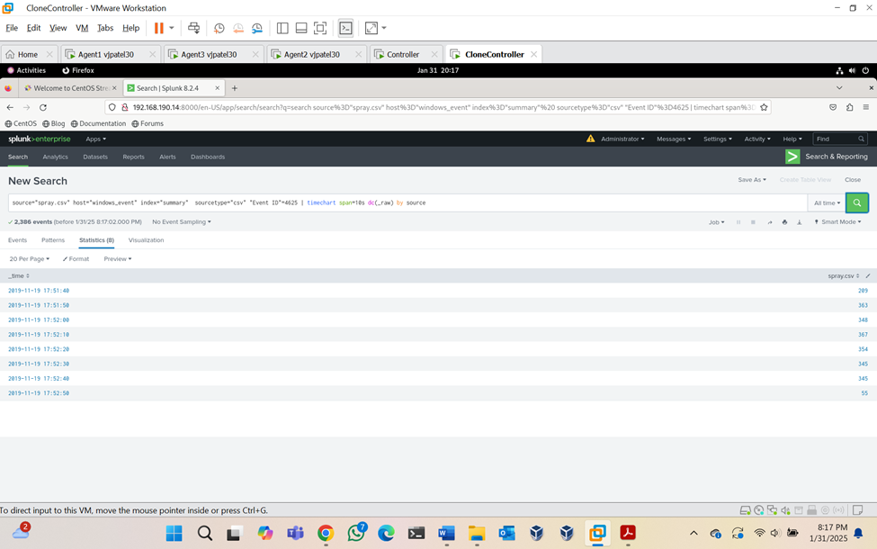
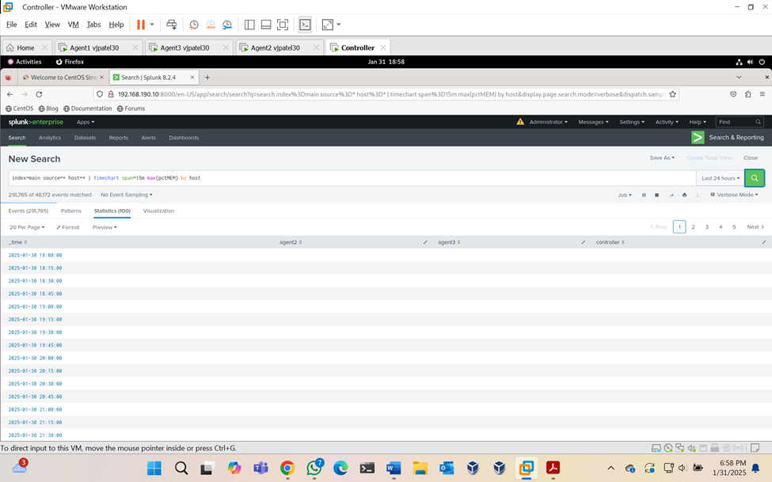

# Splunk Incident Analysis: Brute Force Detection and Security Event Investigation

## Overview

This project simulates a SOC analyst investigation workflow using Splunk as the SIEM. Log data from multiple lab hosts was ingested, correlated, and analyzed to detect brute-force authentication activity, perform false positive analysis, assess incident scope and impact, and produce analyst-ready documentation.

---

## Objective

- Ingest and normalize log data from multiple systems into Splunk
- Use SPL queries, timecharts, and event correlation to investigate suspicious authentication activity
- Apply a structured SOC triage methodology to identify true vs. false positives
- Assess scope and impact of detected activity
- Produce auditable investigation documentation with containment and remediation recommendations

---

## Tools Used

- Splunk (SIEM)
- Windows Security Event Logs
- SPL (Search Processing Language)
- MITRE ATT&CK Framework
- Virtualized Windows/Linux lab environment

---

## Environment

Logs were collected from 4 lab hosts and ingested into a centralized Splunk instance to simulate a multi-endpoint SOC monitoring environment. Event sources included Windows Security logs, authentication logs, and host metrics.

---

## Investigation Walkthrough

### Step 1 — Establish Host Visibility
Confirmed log ingestion from all 4 hosts using host-based queries. Verified event counts and time ranges to ensure complete coverage before beginning investigation.

### Step 2 — Baseline Normal Activity
Reviewed authentication event volume across hosts to establish a normal login baseline. Identified that 3 of 4 hosts showed routine activity; 1 host showed a spike in failed authentication events.

### Step 3 — Investigate Failed Logins (Event ID 4625)
Filtered Windows Security Event Logs for Event ID 4625 (failed logon) on the affected host. Built a timechart to visualize event volume over time.

**Key finding:** Multiple failed login attempts were recorded against the local administrator account within a short window, all originating from a single source IP. The attempts occurred at a consistent automated rate, inconsistent with a human user.

### Step 4 — False Positive Analysis
Assessed whether the activity could be explained by a legitimate user:
- No corresponding successful logon (Event ID 4624) was recorded from the same source IP
- No scheduled task or service account was mapped to that IP
- Source IP had no prior authentication history on this host

**Verdict: True positive.** Activity assessed as an automated brute-force attempt (MITRE ATT&CK T1110.001 - Brute Force: Password Guessing).

### Step 5 — Scope and Impact Assessment
- Only 1 of 4 hosts was targeted
- No successful authentication was recorded — account was not compromised
- No lateral movement indicators observed across remaining hosts
- Impact assessed as low (failed attempt, no breach), but risk rated medium due to exposed service and weak lockout policy

### Step 6 — Containment and Remediation Recommendations
- Block source IP at the perimeter firewall
- Enforce account lockout policy (recommended: 5 failed attempts triggers 15-minute lockout)
- Review exposed services accessible from external IPs
- Enable alerting on high-volume Event ID 4625 activity (threshold: >10 failures in 5 minutes from same source)
- Review password policy and enforce complexity requirements

### Step 7 — Documentation and Handoff
All findings documented with timestamps, SPL queries used, event counts, source IPs (anonymized for lab), analyst conclusions, and recommended next steps — formatted for auditable analyst handoff.

---

## MITRE ATT&CK Mapping

| Technique | ID | Description |
|---|---|---|
| Brute Force: Password Guessing | T1110.001 | Repeated failed logon attempts against administrator account |
| Valid Accounts | T1078 | Target account was a privileged local account |
| Inter-Process Communication | T1559 | Researched as adjacent technique; sub-techniques abused by FIN7 (DDE) and APT32 (COM) |

**Threat Actor Context:**
- **FIN7** has used DDE (T1559.002) in phishing campaigns to execute malicious payloads
- **APT32 (OceanLotus)** has abused COM-based techniques (T1559.001) for persistence and defense evasion

---

## Key Findings Summary

| Finding | Detail |
|---|---|
| Affected Host | 1 of 4 lab hosts |
| Target Account | Local administrator account |
| Successful Login? | No |
| Verdict | True Positive - Brute Force Attempt |
| MITRE Technique | T1110.001 |
| Impact | Low (no breach) / Risk: Medium |

---

## Screenshots

### Centralized Host Visibility in Splunk

### Multi-Host Event Results

### Windows Event Log Analysis

### Failed Login Timechart (Event ID 4625)

### Host Metrics Query Results

---

## Skills Demonstrated

- SIEM log ingestion and multi-host monitoring
- SPL query writing and event correlation
- Structured SOC triage methodology
- True/false positive analysis
- Scope and impact assessment
- MITRE ATT&CK technique mapping
- Threat actor research (FIN7, APT32)
- Analyst-ready incident documentation
- Containment and remediation recommendations

